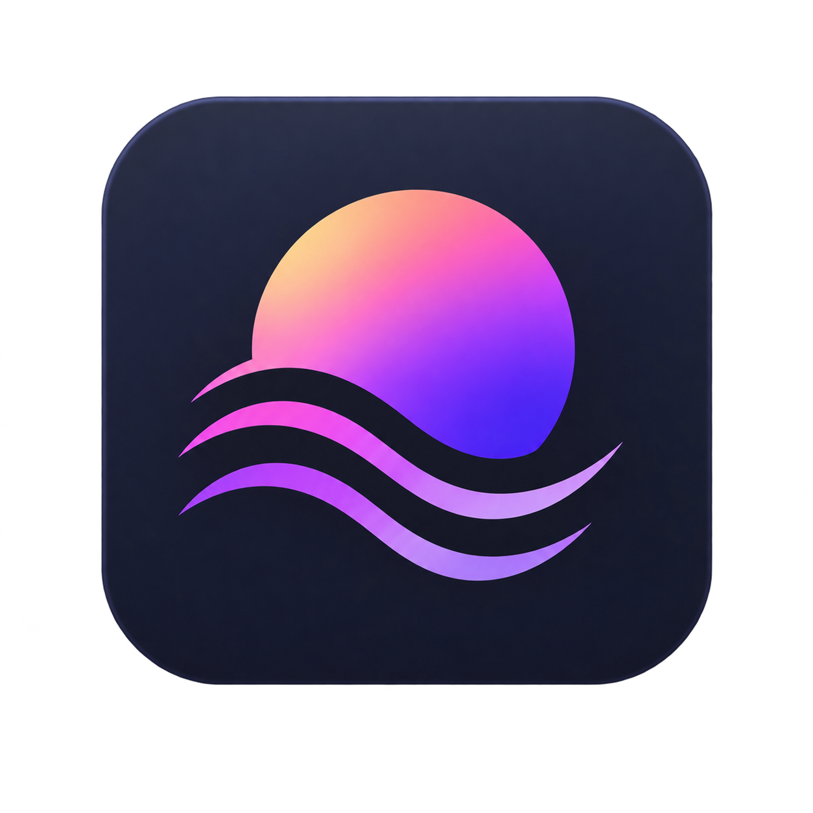
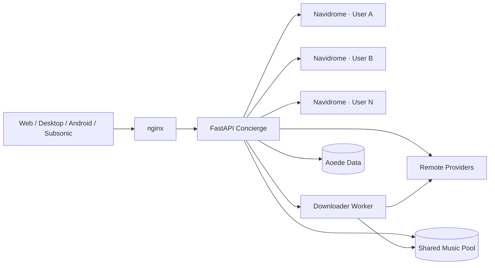

<p align="center">
  
</p>

<h1 align="center">Aoede</h1>

<p align="center">
  <strong>Your music. Your server. Your people.</strong>
</p>

<p align="center">
  A self-hosted, multi-user music platform built around Navidrome.<br>
  Discover music, grow your library, share playlists and listen together — without giving up control of your server.
</p>

<p align="center">
  <a href="https://github.com/sPROFFEs/Aoede/actions/workflows/quality.yml">
    
  </a>
  <a href="https://github.com/sPROFFEs/Aoede/stargazers">
    
  </a>
  
  
  <a href="LICENSE">
    
  </a>
</p>

<p align="center">
  <a href="#quick-start"><strong>Quick Start</strong></a>
  ·
  <a href="#features">Features</a>
  ·
  <a href="#clients">Clients</a>
  ·
  <a href="docs/README.md">Documentation</a>
  ·
  <a href="https://github.com/sPROFFEs/Aoede/releases">Releases</a>
</p>

<br>

<p align="center">
  
</p>

<br>

## What is Aoede?

**Aoede turns a self-hosted music library into a complete multi-user music platform.**

At its core, every user receives an isolated **Navidrome** instance. Around it, Aoede adds everything needed to turn a collection of music files into a much broader experience:

- multi-source music discovery;
- downloads and metadata enrichment;
- personal and collaborative playlists;
- synchronized Party Rooms;
- recommendations and personal mixes;
- smart playlists;
- live radio;
- offline playback;
- Android, desktop and Subsonic clients;
- multi-user administration;
- backups, monitoring and updates;
- shared storage without duplicating the same music for every user.

Aoede is designed for people who want the convenience of modern music platforms while keeping the server, accounts and library under their own control.

> If Aoede is useful to you, consider giving the repository a ⭐.
> It helps other self-hosters discover the project.

---

# Why Aoede?

<table>
<tr>
<td width="50%">

### 🎧 Discover beyond your library

Search your own collection alongside Spotify, YouTube, Last.fm, MusicBrainz and other supported sources.

Preview remote music and add it directly to your server.

</td>

<td width="50%">

### 👤 A music server for every user

Every Aoede account receives an isolated Navidrome instance.

Users share infrastructure and storage without sharing their personal music-server environment.

</td>
</tr>

<tr>
<td width="50%">

### ⬇️ Built-in Download Manager

Search for music or paste supported URLs directly into Aoede.

Track jobs, inspect their status, retry failures and reuse music already present in the shared pool.

</td>

<td width="50%">

### 🤝 Shared & collaborative playlists

Publish playlists to other users, save synchronized copies or invite people to edit playlists together.

</td>
</tr>

<tr>
<td width="50%">

### 🎉 Listen together

Party Rooms provide synchronized playback, shared queues, listener management and host controls.

</td>

<td width="50%">

### 🧠 Rediscover your collection

Personal mixes, recommendations, smart playlists, favorites and smart radio help surface music already on your server.

</td>
</tr>

<tr>
<td width="50%">

### 📱 Use the client you want

Listen through the Aoede web interface, desktop wrapper, Android application or compatible Subsonic clients.

</td>

<td width="50%">

### 🛠️ Manage everything from Aoede

Users, downloads, library maintenance, backups, monitoring, statistics and application updates are available from the admin interface.

</td>
</tr>
</table>

---

# See it in action

## Discover music

<p align="center">
  
</p>

Search your local library and remote music providers from the same interface.

Filter by source, preview remote results and bring new music directly into your shared library.

---

## Download Manager

<p align="center">
  
</p>

Aoede includes a global Download Manager where users can follow active jobs and submit supported URLs directly.

Downloads can resolve music from sources such as:

**Spotify · YouTube · SoundCloud · Audius · Jamendo**

Jobs expose their current state, resolved source, downloader information and failures.

Failed jobs can be retried without leaving the interface.

---

## Shared & collaborative playlists

<p align="center">
  
</p>

Playlists can be:

- private;
- public to other users;
- collaboratively edited;
- copied as synchronized read-only playlists;
- reordered;
- given custom artwork.

Playlist owners retain control over publishing, artwork, collaborators and deletion.

---

## Party Rooms

<p align="center">
  
</p>

Create a room, queue music and listen with other Aoede users using one synchronized playback state.

Hosts control playback while guests follow automatically.

Rooms support shared queues, playlist seeding and optional guest additions.

---

<table>
<tr>
<td width="67%">

### Personal music experience


Home adapts to your library and listening history with recommendations, playlists and personal mixes.

</td>

<td width="33%" align="center">

### Mobile


Use Aoede away from the desktop with background playback and Android media controls.

</td>
</tr>
</table>

---

# Features

## 🔎 Search & music discovery

Aoede combines your existing library with external discovery.

Search results can include:

- local Aoede / Navidrome music;
- Spotify;
- YouTube;
- Last.fm;
- MusicBrainz;
- connected Aoede federation peers.

Source filters allow you to narrow results without switching applications.

Local tracks play immediately.

Remote tracks can be previewed or downloaded when supported.

---

## ✨ Discover

The **Discover** feed recommends music that is not already available on your server.

Recommendations can be:

- previewed;
- downloaded;
- dismissed.

As new music enters the shared pool, it becomes available to users after processing and import complete.

---

# ⬇️ Download Manager

Aoede has a dedicated downloading subsystem rather than treating downloads as a hidden background operation.

Users can:

- download directly from search results;
- paste supported URLs;
- monitor queued jobs;
- inspect processing state;
- inspect resolved source information;
- see downloader details;
- inspect failures;
- retry failed downloads.

A typical download progresses through:

```text
queued → processing → completed
```

Failed jobs retain information about what went wrong and whether a fallback was attempted.

Aoede also checks the shared music pool before storing another copy of existing content.

---

## Shared music pool

Music downloaded or imported into Aoede can be reused across users.

Instead of:

```text
User A/music/song.flac
User B/music/song.flac
User C/music/song.flac
```

Aoede can keep one shared copy while each user maintains their own independent music-server environment.

```text
                 Shared Music Pool
                        │
          ┌─────────────┼─────────────┐
          ▼             ▼             ▼
     Navidrome A   Navidrome B   Navidrome C
          │             │             │
        User A        User B        User C
```

This avoids unnecessary duplication while keeping user environments isolated.

---

# 🎵 Library

Aoede provides searchable and paginated library views for:

- playlists;
- artists;
- albums;
- genres;
- favorites.

Tracks can be played directly or managed through contextual actions.

---

# 📚 Playlists

## Normal playlists

Users can:

- create playlists;
- rename them;
- delete them;
- add and remove tracks;
- reorder tracks;
- upload custom artwork;
- choose artwork from tracks already in the playlist;
- switch playlists between private and public.

---

## 🌍 Public playlists

Public playlists appear to other users on the same Aoede server.

Users can discover music through other people's collections without granting access to edit the original playlist.

---

## 🔄 Synchronized playlist copies

A user can save a read-only copy of another user's public playlist.

That copy can later synchronize with changes made to the original.

This allows people to follow playlists without turning every shared playlist into a collaborative workspace.

---

## 🤝 Collaborative playlists

Playlist owners can invite other Aoede users as collaborators.

Collaborators can:

- add songs;
- remove songs;
- reorder the playlist;
- use the playlist from their own library.

The owner retains control over:

- playlist name;
- publishing;
- artwork;
- collaborator management;
- deletion.

Public visibility and collaboration are intentionally separate permissions.

---

# 🧠 Smart playlists

Smart playlists are dynamic views generated from rules rather than fixed lists of songs.

Rules can include:

- artist;
- album;
- genre;
- minimum release year;
- maximum release year;
- recently added tracks;
- minimum play count;
- tracks not played recently;
- favorites only;
- sorting;
- maximum result count.

A playlist can be previewed before saving.

Smart playlists can also recalculate as your library and favorites evolve.

---

# 🎯 Personal mixes

Aoede generates several local-library mixes from listening activity.

### Repeat

Tracks you repeatedly return to.

### Deep Cuts

Music you know but that sits outside your most obvious rotation.

### Favorites

A mix built around tracks you've liked.

### Rediscovery

Favorites and familiar tracks that have not received much attention recently.

Mixes can also be saved as normal playlists.

---

# 📻 Smart Radio

Start a smart radio from a track or artist.

Aoede uses related music already available in the local library to build the queue.

The results improve as the shared library grows.

---

# 📡 Live Radio

Aoede can also play internet radio.

Users can:

- browse editorial stations;
- search by station;
- search by city;
- play stations immediately;
- save stations;
- remove saved stations later.

---

# 🎧 Player

Aoede includes both compact and full-screen players.

Playback controls include:

- play / pause;
- previous / next;
- seeking;
- volume;
- mute;
- shuffle;
- queue repeat;
- repeat current track;
- favorites;
- add to playlist;
- queue management;
- lyrics;
- sleep timer.

---

## Persistent playback state

Aoede remembers your personal playback context.

Stored state can include:

- current track;
- current queue;
- playback position;
- playback context;
- shuffle mode;
- repeat mode;
- volume.

The state can be restored after opening another session or browser.

---

## Queue management

Tracks can be:

- manually queued;
- reordered;
- removed.

Manually queued tracks take priority over the remaining album, playlist or playback context.

---

## 📝 Lyrics

Aoede supports:

- synchronized lyrics;
- plain lyrics;
- automatic active-line tracking;
- backend caching.

---

## 🌙 Sleep timer

Built-in sleep timer presets include:

- 15 minutes;
- 30 minutes;
- 60 minutes.

Playback automatically pauses when the timer expires.

---

## 🔊 Playback preferences

Per-device playback settings include:

- volume normalization;
- configurable fade duration between tracks.

---

# ❤️ Favorites

Tracks can be marked as favorites throughout the application.

Favorites also feed into:

- personal mixes;
- smart playlists;
- recommendations.

---

# 💾 Offline playback

Music can be stored locally for offline use.

Aoede supports local offline copies of:

- individual tracks;
- playlists.

Browser-side storage uses IndexedDB and can expand available device storage when supported.

Actions performed while disconnected can be synchronized when connectivity returns.

---

# 📊 Wrapped

Administrators can enable Aoede Wrapped periods.

Wrapped can summarize:

- listening time;
- most-played tracks;
- top artists;
- listening patterns;
- Party Room comparisons.

Top tracks from a Wrapped report can also be saved as a playlist.

---

# 🎉 Party Rooms

Party Rooms allow multiple authenticated users to share one synchronized playback session.

A room can contain between **2 and 15 listeners**.

Hosts can:

- play and pause;
- seek;
- change tracks;
- add tracks;
- remove tracks;
- seed the room from a playlist;
- decide whether guests can add music;
- delete the room.

Guests automatically follow the host's playback state.

Room queues can contain up to **500 songs**.

Rooms and queues survive application restarts.

When a listener leaves a room, Aoede restores their personal playback context.

[Read the Party Rooms guide →](docs/PARTY-ROOMS.md)

---

# 📱 Clients

Aoede does not lock you into one interface.

## 🌐 Web

The complete Aoede interface runs in a modern browser.

The web application includes the full library, discovery, download, playlist, Party Room and account experience.

---

## 🖥️ Desktop

Standalone Aoede desktop wrappers are available for:

- Windows;
- Linux;
- macOS.

### Linux / macOS

```bash
curl -fsSL https://raw.githubusercontent.com/sPROFFEs/Aoede/main/install-desktop.sh | bash
```

### Windows

```powershell
irm https://raw.githubusercontent.com/sPROFFEs/Aoede/main/install-desktop.ps1 | iex
```

Portable builds can also be distributed through:

**[GitHub Releases →](https://github.com/sPROFFEs/Aoede/releases)**

---

## 🤖 Android

Aoede releases can include:

```text
aoede-android.apk
aoede-android-source.zip
```

The Android application supports:

- Android 5.0+;
- configurable Aoede server URL;
- background playback;
- system media notification;
- album artwork in notifications;
- track title and artist;
- play / pause;
- next / previous;
- playback while the screen is off.

**[Android documentation →](docs/ANDROID.md)**

---

## 🎶 Subsonic

Every Aoede user's Navidrome instance is also available through its own user-specific Subsonic endpoint.

```text
https://your-domain/<username>
```

Compatible clients include:

- Symfonium;
- Tempo;
- Amperfy;
- other Subsonic-compatible applications.

Users authenticate using the same Aoede credentials.

**[Subsonic setup →](docs/SUBSONIC.md)**

---

# 👥 Multi-user by design

Aoede's account system is not simply multiple logins pointed at one global Navidrome process.

Each regular user gets an isolated Navidrome instance.

```text
                       Aoede
                         │
                FastAPI Concierge
                         │
           ┌─────────────┼─────────────┐
           ▼             ▼             ▼
     Navidrome A   Navidrome B   Navidrome C
           │             │             │
         User A        User B        User C
```

Aoede manages the lifecycle, configuration and routing around those instances.

The shared music pool allows the expensive part — the actual audio files — to be reused.

---

# 🗑️ Track deletion requests

Regular users do not need direct filesystem deletion privileges.

Instead, they can request that a local track be removed.

A request includes:

- the affected track;
- a reason;
- its current approval state.

Administrators can approve or reject it and optionally send a response back to the requesting user.

---

# ⚙️ Account settings

Users can manage:

- avatar;
- password;
- optional Spotify credentials;
- optional Last.fm credentials;
- metadata provider priority;
- YouTube cookies;
- playback preferences;
- session/logout options.

Provider credentials and cookies are handled as secrets and should never be committed to the repository.

---

# 🛡️ Administration

Aoede includes an administration interface designed for self-hosted environments.

Administrative functionality is divided into:

- **User Admin**
- **System Monitor**
- **Download Manager**

---

## 👤 User management

Administrators can:

- create users;
- create administrators;
- reset passwords;
- delete accounts.

---

# 🧹 Library management

The admin interface includes maintenance tools for the shared collection.

### Search tracks

Locate an indexed track and deliberately remove it.

### Duplicate detection

Scan the library for likely duplicate groups and review them manually.

### Library audit

Compare database records with stored files and inspect:

- missing files;
- incomplete metadata;
- source totals;
- loudness-analysis coverage.

### Remove broken entries

Clean database records that refer to files that no longer exist.

### Metadata rescan

Rebuild metadata from the audio currently stored in the library.

### Loudness analysis

Analyze tracks for volume normalization.

Long-running operations execute as background jobs.

---

# ⬇️ Administrative Download Manager

Administrators can inspect and control the downloader subsystem.

Aoede supports downloader policies including:

- **Automatic**
- **Isolated worker only**
- **Legacy Concierge only**

The normal automatic policy prefers the isolated worker while retaining the Concierge implementation as a compatibility fallback.

The isolated downloader keeps download processing separate from the main Aoede application.

---

## Lossless-provider sessions

The Download Manager can also manage optional SpotiFLAC lossless-provider sessions.

Verification can be performed through a short-lived browser running inside the isolated downloader environment so that the challenge and resulting session use the same network context.

Aoede stores the resulting signed provider session rather than asking users to give Aoede their TIDAL, Qobuz, Deezer or Amazon account passwords.

---

# 📈 System Monitor

The built-in monitor exposes operational information such as:

- CPU usage;
- memory usage;
- shared-pool storage usage;
- running build/revision;
- user listening statistics;
- background jobs;
- backup state;
- Wrapped configuration;
- update state;
- storage cleanup tools.

Listening statistics can cover:

- 24 hours;
- 7 days;
- 30 days;
- current year;
- all time.

---

# 💾 Backups

Aoede includes rotating application backup slots.

The System Monitor exposes:

- current backup;
- previous backup;
- automatic backup schedule.

For disaster recovery, host-level backups of `/opt/saas-data` and the deployment `.env` are also recommended.

**[Backup & Restore guide →](docs/BACKUP-RESTORE.md)**

---

# 🔄 Updates

Aoede can check for and apply updates through the administration interface.

```text
Admin
  ↓
System Monitor
  ↓
Check for Updates
  ↓
Apply Update
```

The update workflow can:

- create a backup;
- pull application changes;
- run schema migrations;
- rebuild containers when required;
- perform post-update health checks.

Manual updates are also supported.

---

# 🌐 Federation

> **Beta**

Aoede servers can optionally connect to other Aoede servers.

Federation allows one server to search and stream music from another without copying its complete remote catalog into the local library.

Administrators can:

- issue federation tokens;
- connect remote Aoede servers;
- synchronize remote catalogs;
- disable connections;
- resynchronize connections;
- remove peers;
- revoke issued tokens.

Federation is disabled until explicitly configured by an administrator.

---

# 🏗️ Architecture

Aoede acts as an orchestration and application layer around several independent services.



## FastAPI Concierge

The central Aoede control plane.

It handles:

- authentication;
- user orchestration;
- UI/API services;
- music discovery;
- playlist functionality;
- provider integrations;
- administrative operations.

## Navidrome

Each regular user receives an isolated Navidrome music server.

## Downloader Worker

Downloads can execute in an isolated worker rather than inside the main application service.

## Shared Music Pool

Stores music that can be reused across user libraries.

## nginx

Routes Aoede and user-specific music-server traffic.

## Cloudflare Tunnel

Optional connector for the default remote deployment.

---

# Quick Start

## Requirements

Recommended host:

- Linux;
- Docker Engine;
- Docker Compose plugin (`docker compose`);
- 2+ CPU cores;
- 4 GB RAM;
- SSD-backed storage;
- enough disk space for your music collection.

A domain and Cloudflare account are only required when using the default Cloudflare Tunnel deployment.

---

## Install

```bash
git clone https://github.com/sPROFFEs/Aoede
cd Aoede/Aoede
```

Create the environment file:

```bash
cp .env.example .env
nano .env
```

For the default Cloudflare deployment configure at least:

```dotenv
SECRET_KEY=replace_with_a_long_random_secret
DOMAIN=aoede.example.com
TUNNEL_TOKEN=your_cloudflare_tunnel_token
COOKIE_SECURE=true
```

Then run:

```bash
chmod +x setup.sh
./setup.sh
```

The setup process:

- checks Docker;
- prepares persistent storage;
- builds the application stack;
- can create the first administrator;
- can import an existing music library.

---

# Deployment

Aoede supports three deployment modes.

| Mode | Best for | TLS | Public IP |
|---|---|---|---:|
| **Cloudflare Tunnel** | Simple remote access | Cloudflare | No |
| **Internal** | LAN / VPN / Tailscale | HTTP | No |
| **Direct domain** | Public self-managed deployment | Let's Encrypt | Yes |

### Cloudflare Tunnel

The default deployment.

No inbound port forwarding or public IP is required.

### Internal

Designed for trusted:

- LAN environments;
- VPNs;
- Tailscale;
- development.

### Direct domain

Runs behind your own public hostname with Let's Encrypt TLS.

**[Deployment guide →](docs/DEPLOYMENT.md)**

---

# Import an existing music library

Aoede can import an existing collection into its shared music pool.

From the repository root:

```bash
./import_music.sh /path/to/your/music
```

Metadata enrichment can also be enabled:

```bash
./import_music.sh /path/to/your/music --enrich
```

Read the import documentation before processing a large collection.

**[Importing Music →](docs/IMPORTING-MUSIC.md)**

---

# Persistent data

Persistent application data is stored outside the Git repository by default:

```text
/opt/saas-data
```

This keeps application code separate from:

- music;
- user data;
- databases;
- backups;
- configuration.

---

# Tech stack

| Layer | Technology |
|---|---|
| **Backend** | Python · FastAPI |
| **Music server** | Navidrome |
| **Runtime** | Docker · Docker Compose |
| **Reverse proxy** | nginx |
| **Discovery** | Spotify · YouTube · Last.fm · MusicBrainz |
| **Downloads** | Isolated downloader worker |
| **Remote access** | Cloudflare Tunnel · Let's Encrypt · LAN/VPN |
| **Clients** | Web · Desktop · Android · Subsonic |

---

# Screenshots

The README screenshots live under:

```text
.github/assets/
```

Recommended files:

```text
.github/assets/
├── aoede-hero.webp
├── screenshot-home.webp
├── screenshot-search.webp
├── screenshot-downloads.webp
├── screenshot-playlists.webp
├── screenshot-party.webp
├── screenshot-mobile.webp
├── screenshot-smart-playlists.webp
├── screenshot-wrapped.webp
└── screenshot-admin.webp
```

Use the real Aoede interface rather than generated mockups.

Recommended capture guidance:

**[README Screenshot Guide →](docs/SCREENSHOTS.md)**

---

# Documentation

| Guide | Description |
|---|---|
| [Installation](docs/INSTALLATION.md) | Install Aoede and prepare the host |
| [Deployment](docs/DEPLOYMENT.md) | Cloudflare, LAN/VPN and direct-domain deployment |
| [Configuration](docs/CONFIGURATION.md) | Providers, environment variables and runtime configuration |
| [User Guide](docs/USER-GUIDE.md) | Complete user-facing feature guide |
| [Party Rooms](docs/PARTY-ROOMS.md) | Shared synchronized listening |
| [Importing Music](docs/IMPORTING-MUSIC.md) | Import an existing collection |
| [Android](docs/ANDROID.md) | Android application |
| [Subsonic](docs/SUBSONIC.md) | External Subsonic clients |
| [Administration](docs/ADMINISTRATION.md) | Users, downloads, monitoring and maintenance |
| [Backup & Restore](docs/BACKUP-RESTORE.md) | Backup and disaster recovery |
| [Troubleshooting](docs/TROUBLESHOOTING.md) | Common problems and diagnostics |
| [Architecture](docs/ARCHITECTURE.md) | Containers, storage and data flow |
| [Security](docs/SECURITY.md) | Deployment security |
| [Screenshot Guide](docs/SCREENSHOTS.md) | Creating README screenshots |

**[Browse all documentation →](docs/README.md)**

---

# License

Aoede uses a **Personal Use Only** source-available license.

Private, personal and non-commercial use and modification are allowed.

Without prior written permission, the license does not permit:

- commercial use;
- redistribution;
- sublicensing;
- offering Aoede as a hosted service.

Read the complete **[LICENSE](LICENSE)** before deploying or modifying the project.

---

# Contributing & feedback

Found a bug?

Have an idea?

Something in the documentation unclear?

**[Open an issue →](https://github.com/sPROFFEs/Aoede/issues)**

Feedback from real self-hosted installations is particularly useful.

---

<p align="center">
  
</p>

<p align="center">
  <strong>Own your library. Discover more. Listen together.</strong>
</p>

<p align="center">
  If Aoede improves your self-hosted music setup,<br>
  consider giving the project a ⭐.
</p>

<p align="center">
  <a href="https://github.com/sPROFFEs/Aoede">
    <strong>⭐ Star Aoede on GitHub</strong>
  </a>
</p>
